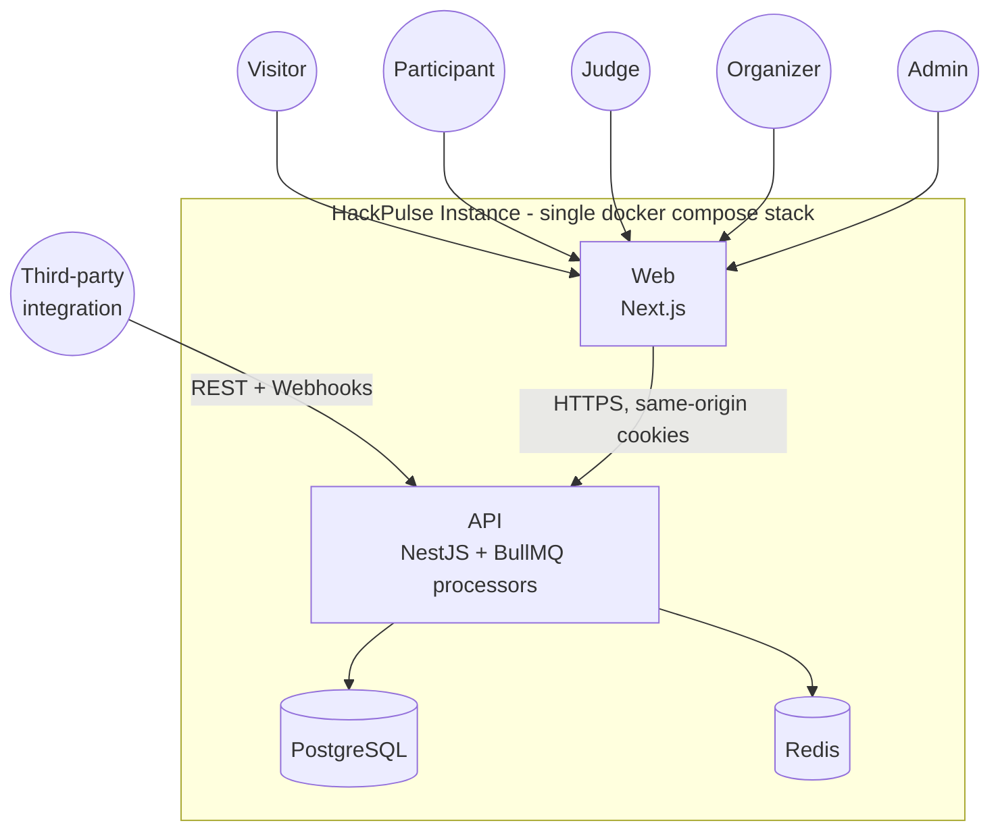
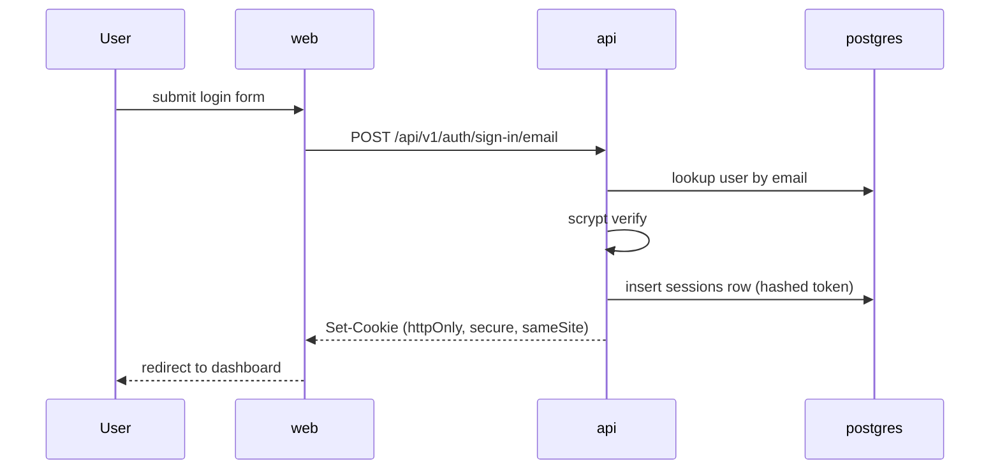
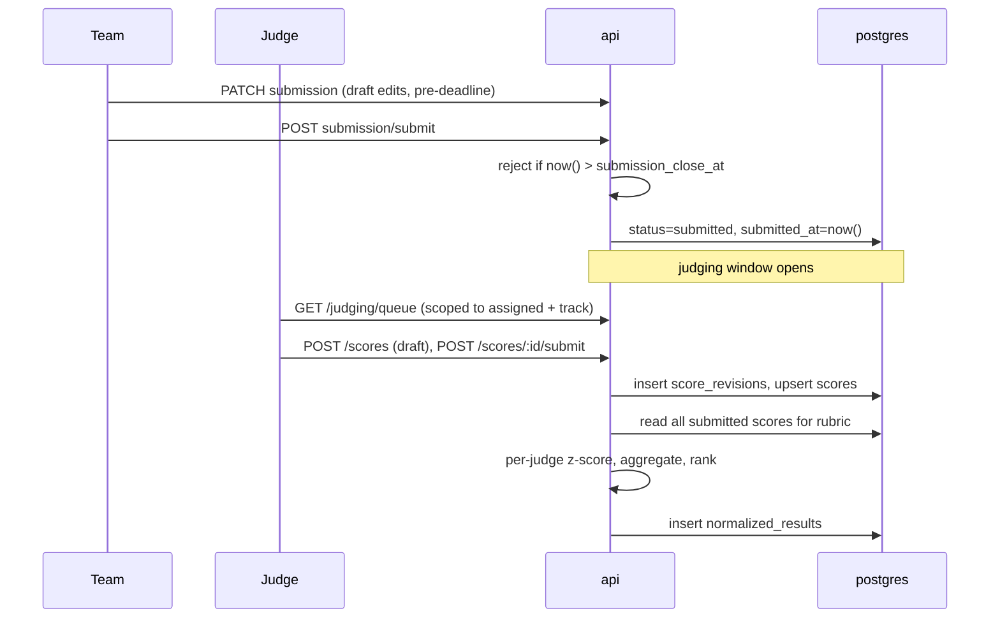
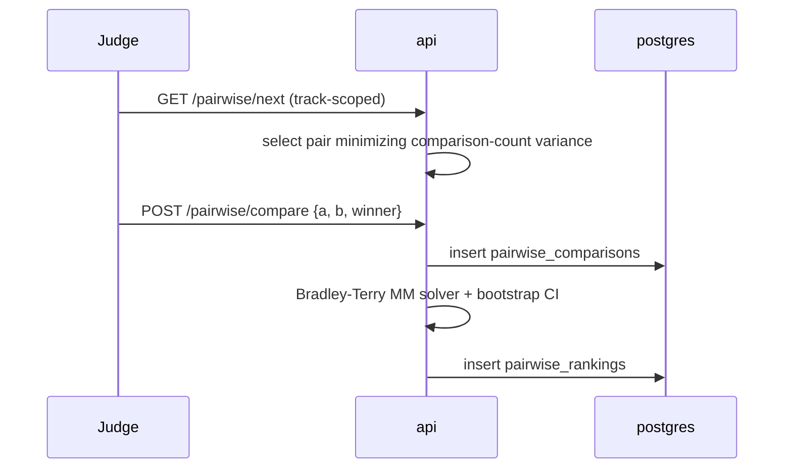

# HackPulse: Architecture

This document describes the shape of the system, why it's shaped that way, and the order in which it gets built. It assumes `REQUIREMENTS.md` (what) and `DATA-MODEL.md` (schema) as inputs.

## 1. System Context



Everything the diagram touches runs in one `docker compose up`. There is nothing outside the box: no managed database, no auth-as-a-service, no external queue or email provider required for the system to function. Found live: this previously drew the BullMQ processors as a separate `Worker` box with its own arrows to `Db`/`Cache`. There is no separate worker process or container (see ADR-007's as-built amendment, and §7); the processors run inside `api`, so they're folded into that one box here rather than implying a deployment split that was never built.

## 2. Containers

| Service    | Technology           | Responsibility                                                                                                                                                                                                                                                                                             |
| ---------- | -------------------- | ---------------------------------------------------------------------------------------------------------------------------------------------------------------------------------------------------------------------------------------------------------------------------------------------------------- |
| `web`      | Next.js (App Router) | Renders every UI surface. Calls `api` exclusively over HTTP; never touches the database directly. No authorization logic lives here beyond hiding controls a user isn't allowed to use; the enforcement is in `api`.                                                                                       |
| `api`      | NestJS on Fastify    | Owns all business logic, authorization, and the REST contract. Every UI action and every third-party integration goes through this one surface (FR-API-01). Also runs the BullMQ `@Processor` consumers (certificate rendering, webhook delivery with retry) in-process; see ADR-007's as-built amendment. |
| `postgres` | PostgreSQL 16        | System of record.                                                                                                                                                                                                                                                                                          |
| `redis`    | Redis 7              | BullMQ job queue backing store; also available for rate-limit counters.                                                                                                                                                                                                                                    |

Found live: this previously listed `worker` as a fifth container with "a different entrypoint" and claimed normalization/ranking recomputation was one of its queued jobs. Neither is true: there is no `worker.ts` entrypoint or `worker` service (§7), and normalization/pairwise recomputation is synchronous inside the request that triggers it (§5.2, §5.3), never queued at all. The only two things actually queued through BullMQ are certificate rendering and webhook delivery, and both run as `@Processor` classes inside the one `api` process.

## 3. Why this split (and not one Next.js app)

A unified Next.js app (UI + API routes in one process) was considered and rejected as the primary architecture, for one concrete reason: **FR-API-01 requires every UI action to exist as a documented, independently callable API action**, and **FR-ROLE-05 requires that role isolation be verifiable by direct HTTP calls, not just through the shipped UI**. Keeping the API in its own service with its own framework (NestJS, chosen specifically for guard/DI-based authorization, see ADR-001) makes that structurally true rather than a discipline the team has to maintain by convention inside a framework whose idiomatic pattern (Server Actions, colocated data fetching) actively encourages blurring the two. `web` is a client of `api` in the same sense a third-party integration is; it just happens to be the one we also built.

## 4. Module Boundaries (`apps/api`)

NestJS feature modules, each owning its own controllers/services/DTOs, matching the requirement groups in `REQUIREMENTS.md` §3:

This is the as-built map: a few things changed shape from the original plan during implementation (noted inline); the requirement coverage didn't change, only the file layout:

```
apps/api/src/
├── auth/            # FR-AUTH: Better Auth mounted on raw Fastify (main.ts), AuthGuard, AuthService
├── users/           # GET /users/me: CurrentUser shape (session + event_roles)
├── events/          # FR-EVT: event lifecycle, tracks, prizes, custom questions
├── teams/           # FR-TEAM: team formation, invites
├── submissions/     # FR-SUB: draft/submit lifecycle, revisions
├── gallery/         # FR-GAL, FR-WIDGET-01: public read model + embeddable widget
├── judging/
│   ├── judges.*             # FR-JASSIGN-01: invite + track-scope
│   ├── rubrics.*            # FR-SCORE-01
│   ├── assignments.*        # FR-JASSIGN-02..03, FR-DASH-01
│   ├── scoring.*            # FR-SCORE-02..05
│   ├── normalization.service.ts  # FR-NORM: z-score engine
│   ├── results.controller.ts     # organizer-only rubric results + normalization-proof
│   ├── guards/assignment-ownership.guard.ts, track-scope.guard.ts  # the isolation guards (see §6)
│   └── pairwise/            # FR-PAIR: Bradley-Terry engine + next-pair selection
├── voting/          # FR-VOTE: single/quadratic, seeded ballot shuffle
├── comments/        # FR-COMMENT
├── results/         # FR-RESULT-01/02/03: the public publish gate (distinct from judging/results.controller.ts, which stays organizer-only pre-publish)
├── bulk/            # FR-EXP-01, FR-BULK-01/02: CSV export + full-archive export/import
├── certificates/    # FR-CERT: PDF rendering (BullMQ), Ed25519 signing key, public verify
├── audit/           # FR-ABUSE-05: the only writer of audit_log_entries; hash-chain + verify
├── webhooks/        # FR-API-03: HMAC-signed delivery via BullMQ, retry/backoff
├── queue/           # BullMQ + Redis connection, registered once at the app root
├── common/
│   ├── guards/roles.guard.ts       # the one generic role/event-scope guard
│   ├── decorators/                 # @Roles(), @Public(), @CurrentUser()
│   ├── pipes/zod-validation.pipe.ts # request validation against @hackpulse/shared schemas
│   └── rate-limiter.service.ts     # in-memory sliding window (auth/vote/comment)
└── main.ts          # single bootstrap entrypoint, see ADR-007 for why there is no separate worker.ts yet
```

**Authorization is enforced by three guard classes, not scattered per-module.** `RolesGuard` (`common/guards`) is the general case: every controller method declares its required role(s) via `@Roles()`, and the guard resolves the caller's role for the event in the route (`:eventId`) against `event_roles` before the handler ever runs. Two more cover the cases the general case doesn't fit, both in `judging/guards`: `AssignmentOwnershipGuard` for a score/assignment route keyed by `:assignmentId` rather than `:eventId` (resolves the assignment first, then checks judge-ownership or organizer override), and `TrackScopeGuard` for a judge-role route keyed by a track directly rather than an owned assignment, pairwise's `next`/`compare` (resolves `judge_track_scopes` for the caller and that specific track). All three guards are unit-tested in isolation from HTTP (23 test cases across them), which is what makes FR-ROLE-01..05 a backend property instead of a per-endpoint habit.

## 5. Request Flows

### 5.1 Authentication



### 5.2 Submission → Judging → Normalization



Normalization recomputes incrementally on every new submitted score, not just once at judging close: the organizer dashboard (FR-DASH-03) always reflects current standings from submitted scores. It happens synchronously inside the same request that submits the score (`ScoringService.submit`/`save` call `NormalizationService.recompute` directly, `apps/api/src/judging/scoring.service.ts`), not on a worker; there is no queue in this path. BullMQ/Redis exist in this deployment, but only for certificate rendering and webhook delivery (ADR-007); normalization and pairwise recomputation are both cheap enough per event (hackathon-scale submission counts) that the extra moving part (a queue, a worker process, a job-failure/retry story) would cost more in operational surface than the synchronous version costs in request latency.

### 5.3 Pairwise Comparison



Same reasoning as 5.2: `PairwiseService.compare` calls `recompute` directly (`apps/api/src/judging/pairwise/pairwise.service.ts`) in the same request, synchronous, not enqueued.

## 6. Authorization Model

Enforcement sits in composable guards, applied in order: two global (`AuthGuard`, `RolesGuard`), plus one of two track/ownership guards depending on how a judge-role route is keyed.

1. **`AuthGuard`**: valid, unexpired, unrevoked session → attaches `CurrentUser`.
2. **`RolesGuard`**: reads `@Roles('organizer','admin')` metadata; resolves the caller's role for the `:eventId` in the route against `event_roles`; `admin` (global) always passes.
3. **`AssignmentOwnershipGuard`**: for score/assignment routes keyed by `:assignmentId` (`scoring.controller.ts`): resolves the assignment, then requires either an organizer of that assignment's event or the judge it was actually assigned to. Track scope isn't separately re-checked here because it doesn't need to be: `AssignmentsService` never creates an assignment for a judge outside their `judge_track_scopes` for that submission's track in the first place, so ownership of the assignment _is_ proof of track scope, structurally.
4. **`TrackScopeGuard`**: for judge-role routes keyed by a track directly rather than an owned assignment (pairwise's `next`/`compare`, `pairwise.controller.ts`): resolves `:trackId` (param, query, or body, whichever the route carries it in) against `judge_track_scopes` for the caller. Same "absence of a scope row is a deny, not an empty result" posture (FR-ROLE-02/03/05).

Found live: this section previously described `TrackScopeGuard` as the _only_ judge-facing guard, resolving `:submissionId → track_id`. No file by that name existed anywhere in the codebase: pairwise's routes had the identical check, but as an imperative `assertJudgeScoped()` call inside `PairwiseService` itself, easy to forget on a future new route since nothing declarative enforced it was ever called. `TrackScopeGuard` is now a real guard class, applied via `@UseGuards()` exactly like `AssignmentOwnershipGuard`, and the redundant in-service check was removed once it existed (same trust boundary as `ScoringService`, which has never duplicated `AssignmentOwnershipGuard`'s check either).

A denied request returns `403` with no information about whether the resource exists at all beyond what the caller is already authorized to know: this is what makes "if I can curl another judge's scores it is not isolation" fail closed rather than fail informative.

Found live: this previously claimed a guard-level interceptor emitted audit events automatically ("complete by construction, not by discipline"); no such interceptor exists anywhere in the codebase (`grep -rln "Interceptor" apps/api/src` returns nothing). What's actually there is each service calling `AuditService.log()` explicitly at the point an action succeeds, by discipline, the exact thing the old text said this design avoided. That discipline is now applied consistently: `auth.sign_in`/`sign_up`/`sign_out` (`main.ts`, the only place these are observable; Better Auth owns `/api/v1/auth/*` directly on Fastify, outside the Nest controller/guard layer entirely), `event_role.granted`/`revoked` and `user.organizer_status_changed`, `score.submit`/`score.edit`, `export.csv`/`export.archive`, `vote.cast`, `results.publish`, `import.csv`, and `submission.deadline_rejected` (FR-ABUSE-04) all write an entry today (`apps/api/src/**/*.service.ts`, `apps/api/src/main.ts`). Auth and the org-status change carry no `eventId` and land in `AuditService`'s "GLOBAL" partition, readable and independently hash-verifiable via the admin-only `GET /audit-log/global` and `GET /audit-log/global/verify` routes (`apps/api/src/audit/audit.controller.ts`), the same `verifyChain()` logic every per-event chain uses.

## 7. Deployment Topology

```
docker-compose.yml
├── postgres      (volume: pgdata, healthcheck: pg_isready)
├── redis         (volume: redisdata)
├── api           (depends_on: postgres healthy, redis healthy; runs migrations + loads fixtures on boot)
└── web           (depends_on: api healthy)
```

Found live: this previously listed a separate `worker` service; `docker-compose.yml` has no such service (`grep -n "^  [a-z]" docker-compose.yml` → `postgres`, `redis`, `api`, `web` only). The BullMQ `@Processor` workers (certificate rendering, webhook delivery) run inside the `api` container itself; see ADR-007's as-built amendment below, which already documents this as a deliberate, tracked gap rather than something silently different from plan. This diagram was the one place left still describing the never-built topology as if it existed.

Boot sequence inside the `api` container entrypoint: run pending Drizzle migrations → load the shared reference dataset (`load-fixtures.ts`, idempotent) → start the HTTP server. This is what makes `docker compose up` alone satisfy NFR-OPS-01: no separate setup step for the operator. `load-fixtures.ts` creates one event from a fixed fixture file (the same on every copy of this portal, so a reviewer comparing deployments is comparing software, not sample data) plus a handful of accounts scoped to that event, all under reserved email domains (`@hackpulse.local`, `@example.org`). It never creates a general-purpose account for a real person to sign in as. Instead, `auth.config.ts`'s `databaseHooks.user.create.after` promotes the first _human_ account — the first registration outside those reserved domains — to admin, which is what lets a real operator bootstrap their own first organizer without a hand-run script, independent of the fixture data.

## 8. Build Roadmap

Phases map to this project's own capability tiers (T1 core, T2 judging, T3 public, T4 stretch — see `REQUIREMENTS.md`), plus a foundation phase before them and a hardening phase after.

**Phase 0: Foundation**
Monorepo scaffold (pnpm workspaces), NestJS + Next.js bootstrapped, Postgres/Redis in Compose, Drizzle schema + first migration, CI-equivalent local scripts (lint, typecheck, test), auth skeleton (register/login/session), the three authorization guards with unit tests proving deny-by-default.

**Phase 1: Core (T1)**
Event CRUD + lifecycle, tracks/prizes/custom questions, team formation + invites, submission draft/edit/submit with deadline enforcement, public gallery with search/filter. Exit criterion: a team can be created, invited to, submit a project, and see it in the gallery, entirely through the API.

**Phase 2: Judging (T2)**
Judge invitation + assignment (manual + algorithmic), rubric authoring, scoring flow, the z-score normalization engine, organizer live-progress dashboard, CSV export at every stage. Exit criterion: the role-isolation matrix passes for every actor/resource pair, verified by an integration test suite that calls the API directly (not through the UI).

**Phase 3: Public (T3)** (done)
Community voting (single + quadratic), randomized ballot ordering, comments + moderation, results-visibility gating, rate limiting, the hash-chained audit log, duplicate-submission detection (a normalized name+description+repoUrl content hash, computed on create/update, surfaced to organizers via `GET .../submissions/duplicates`), all built and live-verified.

**Phase 4: Stretch (T4) + Bonus** (done)
Full webhook system (HMAC-signed, queued, retried), certificate + signed judge-record generation with public verification, embeddable gallery widget, bulk import/export (round-trip verified live: export a real event, import it back, identical track/team/submission/score counts under a new event id), pairwise Bradley-Terry mode with bootstrap confidence intervals (regularization fix included, ADR-013), the documented normalization proof (real worked example in `JUDGING.md`), the written threat model (`THREAT-MODEL.md`).

**Phase 5: Hardening & Documentation** (mostly done)
`JUDGING.md` and `THREAT-MODEL.md` are finished against real test data and real live-test findings, not written speculatively. `apps/web` now covers both the rubric and pairwise judging paths end to end (register/login, browse the gallery, create an event in either lifecycle mode, form/join a team, submit a project, judge by rubric or by pairwise comparison, publish results) as functional Tailwind-styled pages, not mockups; every one of them is a real client of the API, not hardcoded data. This project's own test suite (`apps/api/src/**/*.spec.ts`, unit-level, plus manual live verification against a running stack throughout development) is the acceptance record; see `apps/api/src` for the tests themselves. Not done: a real design pass (this is deliberately plain, functional UI, not a polished product), load testing concurrent scoring (NFR-PERF-02) beyond the transactional guarantees already in place, an accessibility audit, and the demo video.

Each phase is additive: nothing in a later phase requires reopening an earlier phase's schema or API contract, because the data model and API surface were designed against the full requirement set up front rather than grown tier-by-tier.

## 9. Architecture Decision Records

**ADR-001: NestJS for the API, not bare Fastify or Express**
Decision: NestJS on the Fastify adapter.
Why: the authorization model (§6) needs to be a structural property, not a convention. Nest's guards + DI let every route declare its required role/scope and let that logic be unit-tested in isolation from HTTP. Fastify underneath keeps throughput competitive with a bare Fastify app.

**ADR-002: Next.js consumes the API, never bypasses it**
Decision: `web` calls `api` over HTTP for every read and write; no Server Action or Server Component reaches the database directly.
Why: guarantees FR-API-01 (every UI action is an API action) without relying on the team remembering to keep them in sync.

**ADR-003: PostgreSQL, single instance, no read replicas**
Decision: one Postgres instance for the whole system.
Why: the dataset size for a hackathon (thousands of submissions, tens of thousands of scores/votes) does not warrant horizontal read scaling, and a single instance keeps `docker compose up` honest. Window functions (`stddev() over`, `percent_rank()`) are used directly for normalization rather than pulling data into application code.

**ADR-004: Drizzle over Prisma**
Decision: Drizzle ORM.
Why: SQL-first schema definitions read as directly as the table specs in `DATA-MODEL.md`, and normalization/ranking queries need real SQL (window functions, CTEs) rather than an abstraction layer fighting them.

**ADR-005: Better Auth for session management, not a hand-rolled auth module**
Decision: Better Auth, self-hosted against the same Postgres instance, with its own schema.
Why: session lifecycle, password hashing, and CSRF are a well-solved, security-sensitive surface; using a widely-adopted, actively maintained, self-hosted library reduces the chance of a subtle auth bug more than reimplementing it would demonstrate. It remains fully compliant with "no auth-as-a-service" because it never leaves the instance.
Implementation note: `/api/v1/auth/*` is mounted directly on the underlying Fastify instance (`main.ts`), not as Nest controllers, because Fastify always drains the request body stream before a route handler runs: Better Auth's Node adapter (`toNodeHandler`, which reads the raw stream itself) never sees any bytes if mounted normally. The route instead builds a standard Web `Request` from an already-buffered body and calls `auth.handler()` directly, the same fetch-based entrypoint Better Auth exposes for edge/non-Node runtimes. `GET /users/me` is the one real Nest controller in this area: it returns our own `CurrentUser` shape (session user + this account's `event_roles`), which is what `RolesGuard` actually authorizes against.

**ADR-006: Client-side polling for the live dashboard, not SSE or WebSockets**
Decision: the organizer dashboard's judging-progress table calls `GET /events/:eventId/judging/progress` on a plain 30-second `setInterval` (`apps/web/app/events/[eventId]/organizer/page.tsx`), not a push channel.
Why: found live, and this ADR previously claimed the opposite (SSE); that was the plan going in, not what got built, and the doc was never corrected to match. `FR-DASH-01` only needs "near-real-time" (an organizer glancing at a dashboard, not a live leaderboard on a projector), and a judge submitting a score is a low-frequency event relative to a 30-second window. A plain polled `GET` is the same authenticated, role-checked, cacheable endpoint every other read in this app already is, with no separate connection lifecycle, reconnect logic, or reverse-proxy buffering concern to get right. Revisit only if a feature genuinely needs sub-second latency; nothing in this build does.

**ADR-007: BullMQ + Redis for background work**
Decision: certificate rendering and webhook delivery are queued jobs (BullMQ `@Processor`), not inline request work; normalization recomputation stays synchronous (it's fast, and the caller, a judge who just submitted a score, benefits from seeing the result immediately).
Why: keeps API response times independent of PDF rendering or webhook target latency, and gives webhook delivery retry-with-backoff for free.
As-built amendment: the `@Processor` workers currently run in the same process as the HTTP API (`AppModule` imports `WebhooksModule`/`CertificatesModule` directly; there is no separate `worker.ts`/`worker` container). This is functionally correct (verified live, including retry behavior) but does not isolate slow external work (a webhook target that hangs, a PDF render) from the request-serving event loop the way a genuinely separate process would. Splitting it out is a contained follow-up (a `worker.ts` bootstrapping only the queue-consuming modules via `NestFactory.createApplicationContext`, plus a `worker` service in `docker-compose.yml`), deliberately deferred in favor of finishing the remaining tier/bonus scope; noted here rather than left silently as an implied architecture that was never actually built.

**ADR-008: Bradley-Terry solver is hand-written, not a dependency**
Decision: implement the MM (minorization-maximization) algorithm directly in `judging/pairwise`.
Why: no mature, trustworthy npm package exists for this. `JUDGING.md` has to defend the math in writing regardless, so owning a ~100-line, property-tested implementation is strictly better than depending on an unmaintained one.

**ADR-009: Audit log is hash-chained and append-only at the database level**
Decision: `audit_log_entries` has no `UPDATE`/`DELETE` grant for the application's database role; each row embeds the hash of the previous row.
Why: FR-ABUSE-05 requires the log be meaningfully tamper-evident, not just "a table nobody happens to write DELETE against." Enforcing it at the grant level means a compromised or buggy service layer still can't violate it.

**ADR-010: pnpm workspace monorepo (`apps/api`, `apps/web`, `packages/shared`)**
Decision: one repository, one dependency graph, a shared package for Zod schemas used by both API validation and frontend forms.
Why: the API contract (types + validation rules) has exactly one source of truth, referenced by both sides, instead of hand-kept-in-sync duplicates.

**ADR-011: web proxies to the API via a route handler, not `next.config.js` rewrites**
Decision: `apps/web/app/api/v1/[...path]/route.ts` reads `HACKPULSE_API_URL` and forwards every request at request time.
Why: found live, not anticipated: `next.config.js`'s `rewrites()` destinations are resolved once at build time. In a Docker Compose deployment, the API's address (the `api` service's DNS name) is only known once the container is actually running, so a build-time-resolved rewrite silently falls back to whatever it evaluated to during `docker build` (`localhost:3001`, unreachable from inside the `web` container); every proxied request failed with `ECONNREFUSED` until this was replaced with a route handler, which reads `process.env` fresh on every request. This is exactly the kind of bug that unit tests never see and only a full container-network integration run surfaces.

**ADR-012: Better Auth `trustedOrigins` includes the web app's origin explicitly**
Decision: `auth.config.ts` sets `trustedOrigins: [WEB_ORIGIN, BETTER_AUTH_URL]`.
Why: also found live: Better Auth validates the browser's `Origin` header against this list on every state-changing request (this is what makes CSRF-from-a-third-party-page actually fail closed, not just in theory). The browser's real origin is wherever the page is served from (`web`, port 3000), even though the request is proxied server-to-server to the API (port 3001) before Better Auth ever sees it. Trusting only `BETTER_AUTH_URL` (the API's own origin) rejected every real login attempt through the proxy with `MISSING_OR_NULL_ORIGIN`/untrusted-origin errors until both were listed.

**ADR-013: Bradley-Terry strengths are regularized against a phantom opponent**
Decision: every item in `bradley-terry.ts` gets one fictional win and one fictional loss against an opponent pinned at strength 1 (`REGULARIZATION = 1`).
Why: found live, via the exact failure this fixes: unregularized Bradley-Terry's maximum-likelihood strength is unbounded for any item with a perfect win/loss record, which is the common case with the first few comparisons on a new track, not an edge case. In testing, three comparisons (a clean transitive A>B>C) drove one item's fitted strength to `~10^18`, overflowing `pairwise_rankings.bt_strength` (`numeric(10,6)`) and throwing a `500` on the live stack. The phantom-opponent prior is a standard, minimal fix: it only meaningfully pulls an estimate toward "average" when real data is thin, which is exactly the regime where the unregularized estimate is least trustworthy. See `JUDGING.md` §4 for the full statistical writeup and `bradley-terry.spec.ts`'s regression test for the reproduction.
