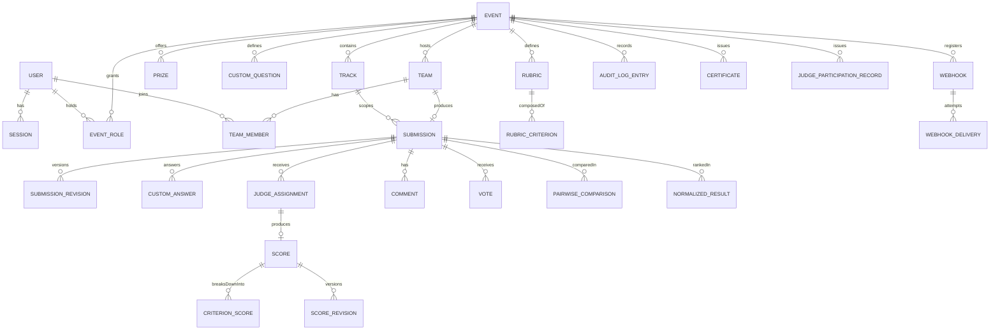

# HackPulse: Data Model

PostgreSQL, managed through Drizzle ORM migrations. This document is the schema contract: `ARCHITECTURE.md` and `API-DESIGN.md` assume these entities and relationships. Requirement IDs (`FR-*`) are cross-referenced from `REQUIREMENTS.md`.

## 1. Entity-Relationship Overview

## 2. Table Specifications

Conventions: every table has `id uuid primary key default gen_random_uuid()`, `created_at timestamptz not null default now()`; tables that are ever updated after creation also carry `updated_at timestamptz`. Foreign keys are `not null` unless marked nullable. Enums are Postgres native enums.

Two Postgres roles exist, not one: migrations run as the schema-owning role (`MIGRATION_DATABASE_URL`), while the running `api` (there is no separate `worker` process; see ADR-007's as-built amendment, `ARCHITECTURE.md` §7) connects as a separate, restricted role (`DATABASE_URL` → `hackpulse_app`) that has full `SELECT/INSERT/UPDATE/DELETE` everywhere _except_ `UPDATE`/`DELETE` on `audit_log_entries`, which are revoked at the grant level (`apps/api/drizzle/0001_restrict_audit_log_grants.sql`). This makes NFR-AUDIT-02 true even against a compromised or buggy service layer, not just "no route happens to expose it."

### `user`, `session`, `account`, `verification` (FR-AUTH): owned by Better Auth

Identity and session tables are **not** hand-defined in our schema: they're generated by Better Auth's own CLI (`npx @better-auth/cli generate`) from `auth.config.ts` and owned by the Drizzle adapter (ADR-005). Every other table's user-referencing foreign keys point at `user.id`, which is `text` (Better Auth's own id generator), not `uuid`.

| Table          | Purpose                                    | Notes                                                                                                                                                                                |
| -------------- | ------------------------------------------ | ------------------------------------------------------------------------------------------------------------------------------------------------------------------------------------ |
| `user`         | Identity                                   | `id` (text PK), `name`, `email` (unique), `emailVerified`, `image`, timestamps, plus our additional fields: `isAdmin` (FR-ROLE-04), `locale` (NFR-UX-02), `timezone` (NFR-UX-01)     |
| `session`      | FR-AUTH-02/03                              | `id`, `userId` → `user.id`, `token` (unique, opaque), `expiresAt`, `ipAddress`, `userAgent`                                                                                          |
| `account`      | Credential storage                         | `userId` → `user.id`, `providerId` (`"credential"` for email/password), `password` (scrypt hash, see ARCHITECTURE.md §5.1); Better Auth stores the password hash here, not on `user` |
| `verification` | Password reset / email verification tokens | `identifier`, `value`, `expiresAt`                                                                                                                                                   |

Regenerating this schema after changing `auth.config.ts` (e.g., adding a field or an OAuth provider) is `pnpm --filter @hackpulse/api run db:generate`-adjacent but distinct: see `apps/api/package.json`'s `db:generate` script for our own tables; Better Auth's own tables are regenerated via its CLI, then a normal Drizzle migration picks up the diff.

Runtime authorization never trusts `user.isAdmin` etc. by re-deriving it per request from scratch: `AuthService.toCurrentUser()` reads the Better Auth session once per request and joins `event_roles` to build the `CurrentUser` shape `RolesGuard` actually authorizes against (see `ARCHITECTURE.md` §6).

### `events` (FR-EVT)

| Column                                       | Type                                                                                          | Notes                                                                                |
| -------------------------------------------- | --------------------------------------------------------------------------------------------- | ------------------------------------------------------------------------------------ |
| id                                           | uuid PK                                                                                       |                                                                                      |
| slug                                         | text unique                                                                                   | URL-safe                                                                             |
| name                                         | text                                                                                          |                                                                                      |
| description                                  | text                                                                                          |                                                                                      |
| owner_user_id                                | uuid FK → users                                                                               | primary organizer                                                                    |
| timezone                                     | text                                                                                          |                                                                                      |
| registration_open_at / registration_close_at | timestamptz nullable                                                                          | all six null together means manual mode (FR-EVT-06): status is moved by hand instead |
| submission_open_at / submission_close_at     | timestamptz nullable                                                                          | enforced server-side when set, FR-SUB-03                                             |
| judging_open_at / judging_close_at           | timestamptz nullable                                                                          |                                                                                      |
| results_publish_at                           | timestamptz nullable                                                                          | manual publish overrides this if set earlier                                         |
| status                                       | enum(`draft`,`registration_open`,`submissions_open`,`judging`,`results_published`,`archived`) | FR-EVT-05                                                                            |
| gallery_visibility                           | enum(`open`,`participants_only`,`hidden`)                                                     | FR-GAL-03                                                                            |
| voting_mode                                  | enum(`disabled`,`single_vote`,`quadratic`)                                                    | FR-VOTE-02                                                                           |
| voting_access                                | enum(`open_link`,`email_gated`,`authenticated`)                                               | FR-VOTE-01                                                                           |
| scoring_mode                                 | enum(`rubric`,`pairwise`)                                                                     | event-wide, never mixed per track                                                    |

### `event_roles` (FR-ROLE, FR-JASSIGN-01)

Grants a user the `organizer` or `judge` role on an event. Participant status is implied by team membership, not stored here.

| Column     | Type                      | Notes |
| ---------- | ------------------------- | ----- |
| id         | uuid PK                   |       |
| event_id   | uuid FK → events          |       |
| user_id    | uuid FK → users           |       |
| role       | enum(`organizer`,`judge`) |       |
| created_at | timestamptz               |       |

Unique on `(event_id, user_id, role)`.

### `judge_track_scopes` (FR-JASSIGN-01, FR-ROLE-03)

| Column        | Type                                         | Notes |
| ------------- | -------------------------------------------- | ----- |
| id            | uuid PK                                      |       |
| event_role_id | uuid FK → event_roles (role must be `judge`) |       |
| track_id      | uuid FK → tracks                             |       |

A judge with no rows here is scoped to no tracks (deny by default).

### `tracks` (FR-EVT-01)

| id, event_id FK, name, description, sort_order |

### `prizes` (FR-EVT-01)

| id, event_id FK, track_id FK nullable, name, description, winner_count int default 1 (check >= 1) |

`winner_count`: how many ranked entries within this prize's scope (that track's ranking if `track_id` is set, the overall ranking otherwise) actually win it, e.g. top 3 rather than just first place. See FR-RESULT-06 for how this determines who's actually notified as a winner.

### `custom_questions` (FR-EVT-04)

| id, event_id FK, track_id FK nullable, label, type enum(`text`,`long_text`,`url`,`number`,`single_select`,`multi_select`), options jsonb nullable, required boolean, sort_order |

### `teams` (FR-TEAM)

| id, event_id FK, name, owner_user_id FK → users, invite_code text unique, invite_code_regenerated_at |

### `team_members` (FR-TEAM-02/04)

| id, team_id FK, user_id FK, joined_at | unique `(team_id, user_id)` |

### `submissions` (FR-SUB)

| Column                             | Type                      | Notes                                      |
| ---------------------------------- | ------------------------- | ------------------------------------------ |
| id                                 | uuid PK                   |                                            |
| team_id                            | uuid FK → teams           |                                            |
| track_id                           | uuid FK → tracks          |                                            |
| name, tagline, description         | text                      |                                            |
| thumbnail_url                      | text                      |                                            |
| gallery_image_urls                 | jsonb (text[])            |                                            |
| demo_video_url, repo_url, live_url | text nullable             |                                            |
| tech_tags                          | text[]                    |                                            |
| status                             | enum(`draft`,`submitted`) | FR-SUB-02                                  |
| content_hash                       | text                      | for duplicate/abuse detection, FR-ABUSE-02 |
| submitted_at                       | timestamptz nullable      |                                            |
| updated_at                         | timestamptz               |                                            |

Unique `(team_id, track_id)`: FR-TEAM-03.

### `submission_revisions` (FR-SUB-04)

| id, submission_id FK, snapshot jsonb, edited_by_user_id FK, created_at |

### `custom_answers`

| id, submission_id FK, custom_question_id FK, value jsonb | unique `(submission_id, custom_question_id)` |

### `judge_assignments` (FR-JASSIGN)

| Column              | Type                                       | Notes                             |
| ------------------- | ------------------------------------------ | --------------------------------- |
| id                  | uuid PK                                    |                                   |
| event_id            | uuid FK                                    | denormalized for query efficiency |
| judge_user_id       | uuid FK → users                            |                                   |
| submission_id       | uuid FK → submissions                      |                                   |
| status              | enum(`assigned`,`in_progress`,`completed`) | FR-DASH-01                        |
| assigned_by_user_id | uuid FK                                    |                                   |
| assigned_at         | timestamptz                                |                                   |

Unique `(judge_user_id, submission_id)`.

### `rubrics` (FR-SCORE-01)

| id, event_id FK, track_id FK nullable, name, scale_min int default 1, scale_max int default 5 |

### `rubric_criteria`

| id, rubric_id FK, name, description, weight numeric(5,4), sort_order | Σ weight per rubric = 1.0000, enforced at write time |

### `scores` (FR-SCORE-02..05)

| Column              | Type                      | Notes                           |
| ------------------- | ------------------------- | ------------------------------- |
| id                  | uuid PK                   |                                 |
| judge_assignment_id | uuid FK unique            | one score per assignment        |
| rubric_id           | uuid FK                   |                                 |
| status              | enum(`draft`,`submitted`) |                                 |
| raw_weighted_score  | numeric(6,3) nullable     | computed on submit, FR-SCORE-03 |
| overall_feedback    | text nullable             |                                 |
| submitted_at        | timestamptz nullable      |                                 |
| updated_at          | timestamptz               |                                 |

### `criterion_scores`

| id, score_id FK, rubric_criterion_id FK, value numeric(4,2), feedback text nullable | unique `(score_id, rubric_criterion_id)` |

### `score_revisions` (FR-SCORE-05, NFR-AUDIT-01)

| id, score_id FK, snapshot jsonb, revised_by_user_id FK, created_at | append-only; raw scores are never overwritten in place |

### `normalized_results` (FR-NORM)

| Column          | Type                      | Notes                                                          |
| --------------- | ------------------------- | -------------------------------------------------------------- |
| id              | uuid PK                   |                                                                |
| submission_id   | uuid FK                   |                                                                |
| rubric_id       | uuid FK                   |                                                                |
| method          | enum(`z_score`,`min_max`) | FR-NORM-02                                                     |
| raw_mean        | numeric(6,3)              |                                                                |
| normalized_mean | numeric(6,3)              |                                                                |
| rank            | int                       | within track                                                   |
| computed_at     | timestamptz               | recomputation creates a new row; latest wins, history retained |

### `pairwise_comparisons` (FR-PAIR)

| id, event_id FK, track_id FK, judge_user_id FK, submission_a_id FK, submission_b_id FK, winner enum(`a`,`b`,`tie`), created_at |

### `pairwise_rankings`

| id, event_id FK, track_id FK, submission_id FK, bt_strength numeric, rank int, ci_low numeric, ci_high numeric, computed_at |

### `votes` (FR-VOTE)

| Column        | Type          | Notes                                                                                      |
| ------------- | ------------- | ------------------------------------------------------------------------------------------ |
| id            | uuid PK       |                                                                                            |
| event_id      | uuid FK       |                                                                                            |
| submission_id | uuid FK       |                                                                                            |
| voter_id      | text          | authenticated user id, or a signed anonymous ballot id for `open_link`/`email_gated` modes |
| votes_cast    | int default 1 | for quadratic voting, this is _n_                                                          |
| cost_paid     | numeric       | √n under quadratic mode, else 1                                                            |
| ip_hash       | text          | abuse detection, never raw IP                                                              |
| created_at    | timestamptz   |                                                                                            |

Unique `(event_id, submission_id, voter_id)`: one ballot entry per voter per submission; changing a vote updates this row, doesn't insert a new one.

### `comments`

| id, submission_id FK, author_label text, author_user_id FK nullable, body text, hidden_at timestamptz nullable, hidden_by_user_id FK nullable, created_at |

### `audit_log_entries` (FR-ABUSE-05, NFR-AUDIT-02)

| Column                     | Type             | Notes                                               |
| -------------------------- | ---------------- | --------------------------------------------------- |
| id                         | uuid PK          |                                                     |
| event_id                   | uuid FK nullable | null for instance-level actions                     |
| actor_user_id              | uuid FK nullable | null for unauthenticated/system actions             |
| action                     | text             | e.g. `score.submit`, `result.publish`, `export.csv` |
| resource_type, resource_id | text             |                                                     |
| metadata                   | jsonb            |                                                     |
| prev_hash                  | text             | hash of the previous entry (chain)                  |
| entry_hash                 | text             | hash of this entry's content + prev_hash            |
| created_at                 | timestamptz      |                                                     |

No `updated_at`, no delete path exists anywhere in the API for this table: enforced by omission and by a database-level `REVOKE UPDATE, DELETE` on the table's role grant.

### `certificates` (FR-CERT-01)

| id, event_id FK, recipient_user_id FK, type enum(`participation`,`winner`,`judge`), pdf_object_key text, issued_at |

### `judge_participation_records` (FR-CERT-02)

| id, event_id FK, judge_user_id FK, payload jsonb, signature text, public_key_id text, issued_at |

### `webhooks` / `webhook_deliveries` (FR-API-03)

`webhooks`: id, event_id FK, target_url, secret, subscribed_events text[], is_active, created_at
`webhook_deliveries`: id, webhook_id FK, event_type, payload jsonb, status enum(`pending`,`succeeded`,`failed`), attempt_count, last_attempt_at, response_code

### `signing_keys` (FR-CERT-02)

| Column          | Type        | Notes                                                     |
| --------------- | ----------- | --------------------------------------------------------- |
| id              | uuid PK     |                                                           |
| public_key_id   | text unique | referenced by `judge_participation_records.public_key_id` |
| public_key_der  | text        | base64 SPKI                                               |
| private_key_der | text        | base64 PKCS8, never leaves the api/worker containers      |
| created_at      | timestamptz |                                                           |

One Ed25519 keypair per instance, generated lazily on first certificate issuance and persisted here (there is no external KMS in a no-cloud-dependency system, so the database _is_ the key store, ADR in `ARCHITECTURE.md` §9). Generation is serialized with a Postgres advisory lock so two concurrent first-uses can't each generate and insert a competing key.

## 3. Import / Export Paths (FR-BULK, NFR-PORT-01)

- **Per-resource export/import** (implemented, `apps/api/src/bulk/export.service.ts`/`csv-import.service.ts`): one endpoint per resource in FR-EXP-01 (registrations, teams, submissions, assignments, scores, normalized-results, votes, audit-log), joined for human readability (a judge's email, not a bare user id) rather than a raw table dump. CSV and JSON are both accepted on import and both offered on export, same rows either way, picked by file extension; import applies the identical per-row validation regardless of which format a row came from. Duplicate handling on import matches what the live UI already enforces: a person can join at most one team per event, one team name per event, one submission per team per track.
- **Full-event archive export/import** (implemented, `apps/api/src/bulk/archive.service.ts`): a single JSON document containing the event's structure and substantive product data: tracks, prizes, custom questions, rubrics and criteria, teams and members, submissions and custom answers, judge assignments, scores and criterion scores, votes, and comments. Deliberately **out of scope for the archive**, with reasons:
  - `normalized_results` / `pairwise_rankings`: derived, cached computation, not source data; regenerable by recomputing from the raw scores/comparisons the archive _does_ carry.
  - `audit_log_entries`: append-only and instance-specific by construction (ADR-009); importing one into a freshly-created event would fabricate a history that never happened on that instance.
  - Account credentials: Better Auth's concern. User references travel as **email addresses**, resolved against whatever accounts already exist on the importing instance; a referenced person who hasn't registered there yet can't be conjured a working account, so their reference falls back to the importer and is reported as a warning rather than silently dropped or failing the whole import.
  - Import always creates a **new** event (never overwrites), with a slug suffix appended on collision: this is what makes "round-trip export → import" produce a second, independent, fully working copy rather than requiring destructive replacement of the original. Verified live: exporting the seeded demo event and re-importing it reproduced the exact same track/team/submission/score counts under a new event id.

## 4. Indexing Notes

Found live: this section described five indexes as if they existed; only the tables' primary keys and unique constraints actually did. Fixed: the four below are now real indexes in the schema (`apps/api/src/db/schema/`), not just intent, applied via `drizzle/0009_noisy_baron_zemo.sql`.

- `submissions(track_id, status)`: gallery listing and judging pool queries.
- `judge_assignments(judge_user_id, status)`: "my queue" and dashboard progress queries.
- `scores(rubric_id, status)` partial index `where status = 'submitted'`: normalization computation reads only submitted scores.
- `audit_log_entries(event_id, created_at)`: chronological audit reads (`AuditService.list`/`verifyChain`).
- `votes(event_id, submission_id)`: tally computation. No separate index needed for this one: the existing `unique(event_id, submission_id, voter_id)` constraint's underlying index already serves it, since a leftmost prefix of a multi-column B-tree index (`event_id` alone, or `event_id, submission_id` together) is usable on its own; adding a second, narrower index on the same leading columns would just be redundant write overhead.
