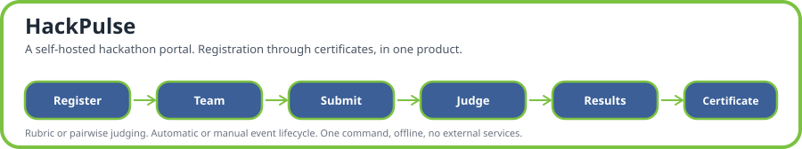

# HackPulse



HackPulse is a self-hosted hackathon portal. It takes an event from registration all the way through certificates, in one product, run entirely on your own machine with no cloud account and no external services required.

```bash
docker compose up
```

That one command brings up Postgres, Redis, the API, and the web app. The instance boots with one shared reference event loaded (a fixed fixture dataset — tracks, teams, projects, judges, scores — the same on every copy of this portal, so anyone comparing two deployments is comparing the software, not the sample data), but no general demo accounts: open **http://localhost:3000**, register your own account, and it's automatically promoted to admin, since it's the first real account on the instance. The fixture dataset's own accounts (any email ending `@hackpulse.local` or `@example.org`) are deliberately excluded from that count, so they never win admin no matter how many of them already exist. This admin promotion is a one-time bootstrap, not something re-grantable later: every account after the first registers as a plain participant, and there's no UI or API path to promote a second account to admin. An admin can grant _organizer_ access (the ability to create and run events) to any other account from that account's profile page (`PATCH /users/:userId/organizer-status`), but admin itself stays put.

## What it does

- **Auth and roles**: session-based sign in, with a role model (visitor, participant, judge, organizer, admin) enforced by the backend, not just hidden in the UI. A person can hold different roles on different events.
- **Events, teams, submissions**: full draft to submit lifecycle with real deadline enforcement, custom submission questions, and a public gallery with search and configurable visibility.
- **Judging, two ways**: weighted rubric scoring with per-judge normalization, or head to head pairwise comparison with a Bradley-Terry ranking, whichever an organizer picks per event. See **[JUDGING.md § Worked example](JUDGING.md#worked-example-real-numbers-from-a-live-run-reproducible-on-demand)** for the actual maths, worked through on real data.
- **Two ways to run an event**: automatic mode (set six dates up front, everything advances on its own) or manual mode (an organizer moves the event through its lifecycle by hand). Both are fully supported, not one real path and one afterthought.
- **Community features**: voting (single vote or quadratic), comments, and results that stay hidden from everyone but organizers until explicitly published.
- **Integrity**: a tamper-evident, hash-chained audit log with a public endpoint to verify it, plus rate limiting on the endpoints that matter. See **[THREAT-MODEL.md](THREAT-MODEL.md)** for what's covered and what honestly isn't.
- **Extras**: signed webhooks, PDF certificates with publicly verifiable judge-participation records, an embeddable gallery widget for an organizer's own site, and CSV/JSON export and import for every resource, including a full event archive that round trips.

## What it does not do yet

- No email delivery of any kind. Judge invites grant a role to an existing account directly, there's no password reset email flow either. This is a deliberate consequence of running with no external services, not an oversight.
- Background jobs (webhook delivery, certificate rendering) run in the same process as the API rather than a separate worker, so they don't get their own failure isolation under heavy load. See [ARCHITECTURE.md § 2 Containers](ARCHITECTURE.md#2-containers) for the detail.
- No automated judge collusion detection, only the normalization method's built in resistance to a single degenerate judge.
- The web UI is functional but plain, and covers the everyday path rather than every corner of the API (certificate download, webhook management, and bulk import and export all exist and are tested through the API, just not through a UI page yet).

## Documentation

| Doc                                               | What's in it                                                                              |
| ------------------------------------------------- | ----------------------------------------------------------------------------------------- |
| [GUIDE.md](GUIDE.md)                              | A first-timer's walkthrough of every feature, with screenshots                            |
| [REQUIREMENTS.md](REQUIREMENTS.md)                | Every requirement, functional and otherwise, with a stable ID                             |
| [DATA-MODEL.md](DATA-MODEL.md)                    | Schema, entity relationships, import and export paths                                     |
| [ARCHITECTURE.md](ARCHITECTURE.md)                | System design, module boundaries, request flows, decision records                         |
| [API-DESIGN.md](API-DESIGN.md)                    | API conventions and a route by route map                                                  |
| [docs/openapi.yaml](docs/openapi.yaml)            | The generated OpenAPI 3.0 spec, also served live at `/api/v1/docs-json`                   |
| [JUDGING.md](JUDGING.md)                          | Assignment strategy and the scoring maths, defended with a real worked example            |
| [THREAT-MODEL.md](THREAT-MODEL.md)                | Named attacks, what actually stops each one, and what honestly doesn't                    |
| [fixtures.json](fixtures.json) / [run.py](run.py) | The shared reference dataset loaded at boot, and the acceptance checker it's read against |
| [acceptance-report.txt](acceptance-report.txt)    | `run.py`'s real output against this repo's `.dogfood.toml`                                |
| [.dogfood.toml](.dogfood.toml)                    | Where things are, which tiers are claimed, and how `run.py` reaches them                  |
| [VERIFICATION.md](VERIFICATION.md)                | Step by step: clone this, boot it, and independently confirm every claim above is real    |

## Stack

- **Frontend**: Next.js (App Router), a client of the API and nothing more.
- **Backend**: NestJS on Fastify. Every UI action is a real, documented API call; the backend owns all business logic and authorization.
- **Database**: PostgreSQL via Drizzle ORM, with a restricted runtime role that can't tamper with the audit log even if the application itself were compromised.
- **Auth**: Better Auth, self-hosted against the same database.
- **Queue**: BullMQ and Redis, for certificate rendering and webhook delivery.
- **Monorepo**: pnpm workspaces (`apps/api`, `apps/web`, `packages/shared`).

Full rationale for each choice, including a few found live along the way, is in [ARCHITECTURE.md § 9 Architecture Decision Records](ARCHITECTURE.md#9-architecture-decision-records).

## Local development (without Docker)

```bash
pnpm install
docker compose up -d postgres redis   # just the two services
pnpm --filter @hackpulse/api run db:migrate
pnpm --filter @hackpulse/api exec tsx src/db/load-fixtures.ts
pnpm dev:api   # apps/api on :3001
pnpm dev:web   # apps/web on :3000
```

Copy `.env.example` to `apps/api/.env` first; the defaults already match the compose services on their host mapped ports.

## Tests

```bash
pnpm --filter @hackpulse/api run test        # unit tests: guards, audit hash chaining, Bradley-Terry, seeded shuffle
pnpm --filter @hackpulse/api run typecheck
python3 run.py .dogfood.toml                 # end-to-end acceptance check against a running stack
```

Everything in this repo was also verified live against a real running stack during development, not just unit tested: role isolation with real calls from real accounts, the audit chain against real tampering, a full archive export and import round trip, and so on. That process is what caught most of the bugs fixed along the way.

`run.py`'s own `[auth]` cookies in `.dogfood.toml` are real, signed Better Auth sessions, minted when `load-fixtures.ts` last ran, not fixed constants — a fresh `docker compose up` against a clean volume mints new ones. If `run.py` reports 401s where it previously passed, search the `api` container's logs for "Test logins" and paste the freshly printed values into `.dogfood.toml`'s `[auth]` section before rerunning.

## Code quality

```bash
pnpm run format        # Prettier, writes
pnpm run format:check  # Prettier, fails if anything isn't formatted
pnpm run lint          # ESLint: unused imports, import order, and more
pnpm run lint:fix      # same, with --fix
pnpm run dup-check      # jscpd, flags copy pasted code above a small threshold
```

A pre-commit hook runs Prettier on staged files; CI runs the full set (format, typecheck, lint, test, build) on every push, since a hook alone can be skipped.

## Seeded reference data

On first boot, `apps/api/src/db/load-fixtures.ts` loads [fixtures.json](fixtures.json) into the database. It loads once and skips on later boots. `docker compose down -v` wipes the volume, so the next `docker compose up` reseeds from scratch.

**What's loaded**: one event, "Sample Hack 2026", in the `judging` phase (submissions closed, gallery open, voting disabled, results unpublished). It has 8 tracks, one rubric (Functionality, Quality, Innovation, scored 1 to 5), 40 teams with one submission each, 30 judges, and around 125 submitted scores, already normalized so the organizer results endpoints work straight away.

**Accounts**: every seeded account uses the password `dogfood-check-1`.

| Email                                              | Role on the event                       | Notes                                                                      |
| -------------------------------------------------- | --------------------------------------- | -------------------------------------------------------------------------- |
| `dogfood-organizer@hackpulse.local`                | Organizer (event owner)                 | Can create events; not an admin                                            |
| `dogfood-judge-a@hackpulse.local`                  | Judge, scoped to the Security track     | Assigned "Glass Signal", the assignment `run.py` reads                     |
| `dogfood-judge-b@hackpulse.local`                  | Judge, scoped to the Security track     | Assigned "North Drift", so it's refused judge A's scores                   |
| `dogfood-participant@hackpulse.local`              | Participant                             | Owns "Dogfood Probe Team", which has no submission                         |
| `firstname.lastname@example.org` (30 accounts)     | Judge, scoped to the tracks they scored | One per fixture judge, e.g. `tomas.varga@example.org`                      |
| `name1@example.org`, `name2@example.org`, ... (40) | Participant, team owner                 | One per team, e.g. `priya1@example.org`; other team members aren't created |

No seeded account is an admin. The first account you register yourself becomes the admin, since anything ending in `@hackpulse.local` or `@example.org` doesn't count towards that.

> These credentials are public. If you deploy beyond localhost, delete or change the seeded accounts first.

### Quirks in the seeded data

The fixture data is deliberately awkward, so the judging system gets exercised on more than tidy numbers. The figures below are from a live run against this data.

- **A duplicate project is skipped.** `prj_07` and `prj_41` are the same team in the same track, and the schema allows one submission per team per track. The second is skipped at load, so there are 40 submissions, not 41. Its scores are skipped too.
- **Judges with no spread.** One judge gives every project the same score, and two judges have only a single score each. Their spread is zero, so their normalized score is 0 rather than a divide-by-zero. Only the first is flagged by `outlier-judges` (as `nearZeroVariance`), because that check needs at least 2 scores. See [JUDGING.md § 3](JUDGING.md#3-cross-judge-normalization-per-judge-z-score) for why a zero-spread judge is averaged in as 0 and not excluded.
- **Judges who disagree with their peers.** Five judges rank projects roughly opposite to the other judges (correlation below -0.3), which `outlier-judges` reports as `divergesFromPeers`. Each is judged on only 3 or 4 shared projects, so treat it as a prompt to look, not a verdict.
- **Normalization changes the outcome.** Of the 40 ranked projects, 37 rank differently under z-score normalization than under a plain raw average, by as much as 24 places, and only 3 of the top 5 are the same. That difference is what the normalization is for.
- **The event's audit log starts empty.** Seeding writes straight to the database, not through the API, so nothing is logged until someone acts on the event.

To see the judging results yourself, sign in as the organizer, get the rubric id from `GET /api/v1/events/d06f00d0-0000-4000-8000-000000000000/judging/rubrics`, then call `.../judging/results/normalization-proof?rubricId=<id>` and `.../judging/results/outlier-judges?rubricId=<id>` on the same event.

## License

MIT; see [LICENSE](LICENSE).
